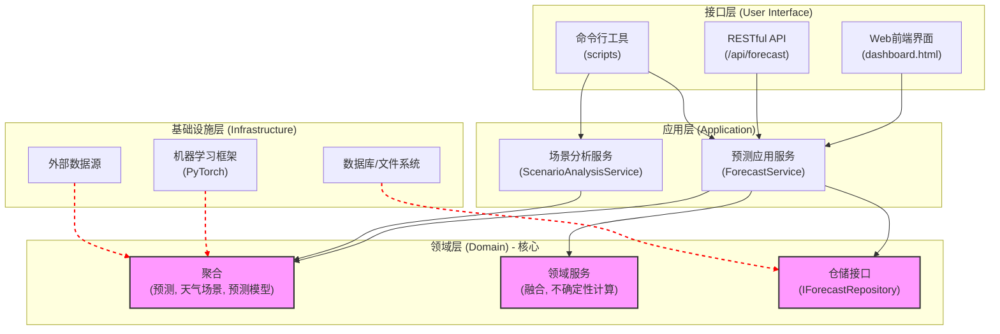

# 1. 项目架构设计：天气感知负荷预测系统

## 1.1. 设计理念

本项目采用**领域驱动设计（DDD）**与**整洁架构（Clean Architecture）**思想，构建一个分工明确、高内聚、低耦合的四层架构。其核心原则是**依赖倒置**：业务核心（领域层）不依赖于任何具体的技术实现，而是由技术实现来依赖核心。这确保了系统的核心逻辑稳定、可测试，并且能够灵活地适应未来的技术变更。

## 1.2. 架构图

## 1.3. 各层详解

### 1.3.1. 接口层 (User Interface Layer)

**职责**：系统的"门面"，负责与外部世界（用户或其他系统）打交道，接收指令和展示结果。

-   **Web前端界面**：一个可视化的操作界面，就像 `dashboard.html`，用户可以在上面点击按钮，查看预测曲线图和分析报告。
-   **RESTful API**：提供给其他程序调用的"服务窗口"。例如，调度系统可以通过访问 `/api/forecast` 接口来自动获取最新的预测数据。
-   **命令行工具 (CLI)**：提供给技术人员或用于自动化任务的"快捷方式"。我们现有的 `scripts` 目录下的脚本就属于这一类，可以用来快速执行模型训练、数据分析等任务。

### 1.3.2. 应用层 (Application Layer)

**职责**：系统的"总指挥"，负责协调领域层的各个"专家"（聚合、领域服务）来完成一个完整的业务流程（也叫"用例"）。它不包含具体的业务规则，只负责"编排"和"调度"。

-   **预测应用服务 (ForecastService)**：负责处理所有与"做预测"相关的请求。例如，当用户点击"开始日前预测"时，这个服务会被激活，它会依次调用领域层的能力：加载模型、获取天气数据、执行预测、计算不确定性、最后保存预测结果。
-   **场景分析服务 (ScenarioAnalysisService)**：负责处理"天气场景分析"的请求。它会调用领域层能力来完成聚类分析、生成报告等工作。
-   **模型管理服务 (ModelManagementService)**：负责模型的训练、评估和部署等生命周期管理。

### 1.3.3. 领域层 (Domain Layer)

**职责**：系统的"心脏"和"大脑"，所有核心的业务知识、规则和逻辑都存放在这里。这是我们最宝贵的财富，它完全独立，不知道数据库、界面等长什么样。

-   **聚合 (Aggregates)**：代表我们业务中最核心的"东西"，它们是数据和操作的集合体，并保证自身数据的一致性。
    -   `预测 (Forecast)`：一个核心聚合。它包含了预测的时间点、预测值、预测区间的上限和下限，以及这次预测是基于哪个 `天气场景` 和哪个 `预测模型` 做出的。所有与"一次预测"相关的信息都被封装在这里，形成一个整体。
    -   `天气场景 (WeatherScenario)`：另一个核心聚合。它定义了一种天气模式，比如"极端高温高湿"，并包含了它的特征（温度>32°C）和业务规则（不确定性倍数为3.0x）。
    -   `预测模型 (PredictionModel)`：代表一个训练好的深度学习模型文件。它包含了模型的元数据，如适用的预测类型（负荷/光伏）、版本、性能指标等。

-   **领域服务 (Domain Services)**：当一些重要的业务逻辑不适合放在任何一个单独的聚合里时，我们用领域服务来实现。
    -   `多区域融合服务 (ForecastFusionService)`：负责实现 `README.md` 中提到的复杂的多省份预测融合逻辑。
    -   `不确定性计算服务 (UncertaintyCalculationService)`：负责执行核心的"天气场景感知动态不确定性"计算公式。

-   **仓储接口 (Repository Interfaces)**：定义了如何存取我们的聚合（比如 `Forecast`），但只定义"需要做什么"（如 `save(forecast)`、`findById(id)`)，不关心"具体怎么做"。
    -   `IForecastRepository`: 定义了保存和获取 `Forecast` 聚合的接口。
    -   `IModelRepository`: 定义了加载和管理 `PredictionModel` 聚合的接口。

### 1.3.4. 基础设施层 (Infrastructure Layer)

**职责**：系统的"工具库"和"管道"，为其他层提供所有与外部技术相关的具体实现，比如操作数据库、读写文件、调用第三方API等。

-   **数据库/文件系统**：这里是仓储接口的具体实现。比如，`FileForecastRepository` 实现了 `IForecastRepository` 接口，将 `Forecast` 对象存为 JSON 文件；而未来如果想用数据库，我们只需要再写一个 `PostgresForecastRepository` 即可，领域层完全不需要改动。
-   **机器学习框架**：封装了 PyTorch、TensorFlow 等库的具体调用代码。领域层的 `PredictionModel` 只是发号施令，具体的模型加载、推理运算都在这里完成。
-   **外部数据源**：负责从各种地方获取原始数据。比如，从CSV文件里读取历史负荷数据，或者调用某个天气网站的API获取实时气象信息。
-   **Web框架**：提供Web服务的具体实现，如 Flask 或 FastAPI，它们负责解析HTTP请求，并调用应用层的服务。

通过这样的设计，我们就构建了一个既强大又灵活的系统。无论未来前端技术如何变化，或者我们想从文件存储切换到高性能数据库，我们最核心的"大脑"（领域层）都安然无恙，可以持续稳定地为我们创造价值。
