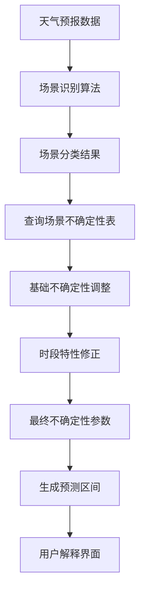

# 多源电力预测与调度平台

## 项目概述

这是一个基于深度学习的**多源数据融合电网概率负荷预测系统**，支持负荷、光伏、风电预测，具备多种预测模式和先进的不确定性建模能力。系统特别引入了**天气场景感知的动态不确定性建模**，能够根据具体的天气场景动态调整不确定性表征，为用户提供更准确的预测区间和详细的不确定性分析。

## 🚀 部署方案

本项目支持两种部署方式，推荐根据您的网络环境选择：

### 方案一：本地Python部署（推荐）
适用于网络限制或Docker镜像拉取困难的环境：

```bash
# 1. 安装Python（双击运行）
install_python.bat

# 2. 一键启动项目
run_local.bat
```

### 方案二：Docker化部署
适用于网络良好的环境：

```bash
# 1. 配置Docker镜像加速器（参考docker-网络问题解决指南.md）
# 2. 双击运行部署脚本
deploy_fix.bat

# 或手动执行
docker-compose up --build -d
```

### 部署文件说明
- `Dockerfile` - Docker镜像构建文件
- `docker-compose.yml` - 容器编排配置
- `requirements.txt` - Python依赖包列表
- `.dockerignore` - Docker构建忽略文件
- `deploy.bat` - Windows一键部署脚本
- `docker-deploy.md` - 详细部署指南

### 访问应用
部署成功后访问：
- 🌐 应用主页: http://localhost:5000
- ⚡ 健康检查: http://localhost:5000/api/health
- 📊 API文档: http://localhost:5000/api/

### 系统要求
- Windows 10/11
- 8GB+ 内存 (推荐16GB)
- 20GB+ 可用磁盘空间
- Docker Desktop for Windows

详细部署说明请参考：[Docker部署指南](docker-deploy.md)

## 📋 演示文档

**📊 PPT演示文稿**：[基于多源数据融合的电网概率负荷预测方法 - PPT演示](docs/presentation.html)
- 类似PowerPoint的幻灯片演示体验
- 9页完整技术汇报内容，支持键盘和鼠标翻页
- 适合技术汇报、会议演示和客户展示

**🌐 在线演示网页**：[基于多源数据融合的电网概率负荷预测方法 - 交互式演示](docs/demo_webpage.html)
- 专业的可视化技术演示网页
- 现代化的UI设计和交互体验
- 完整展示技术特色、应用效果和创新点

**🎯 技术演示大纲**：[基于多源数据融合的电网概率负荷预测方法 - 技术演示大纲](docs/技术演示大纲.md)
- 快速了解系统核心特色和技术创新点
- 包含实际应用效果和使用方法

**📖 完整技术演示文档**：[基于多源数据融合的电网概率负荷预测方法演示文档](docs/多源数据融合电网概率负荷预测方法演示文档.md)

该文档详细介绍了：
- 🏗️ **系统技术架构**：多源数据融合、天气场景感知、多层次预测体系
- 🔬 **负荷预测方法**：深度学习模型、特征工程、17种天气场景识别
- 📊 **不确定性量化**：动态不确定性建模、区间预测生成、概率分布建模
- 📥📤 **输入输出规范**：数据格式、不确定性来源、负荷不确定度表征
- 🌐 **区域聚合预测**：省际相关性建模、聚合不确定性处理
- 📈 **实际应用效果**：华东地区验证结果、预测精度表现
- 🚀 **技术创新点**：17种场景识别、动态不确定性、多源数据融合

## 🏗️ 系统架构 (System Architecture)

为了确保系统的长期可维护性、可扩展性和可测试性，本项目采纳了**领域驱动设计（DDD）**与**整洁架构（Clean Architecture）**作为核心设计思想。我们将业务逻辑与技术实现严格分离，构建了一个清晰、稳健的四层架构。

**核心优势**：
- **核心独立**：预测算法等核心业务逻辑独立于任何框架和数据库，易于升级和迁移。
- **职责清晰**：各层分工明确，降低了系统复杂度，提升了开发效率。
- **高度可测**：业务核心可在无任何外部依赖（如数据库）的情况下进行单元测试。

**详细架构设计方案请参考**：
- 📖 **[系统架构设计文档](AveMujica_DDD/architext.md)**

## 核心功能

### 1. 🌟 天气场景聚类分析

#### 全年天气负荷场景识别与分析
本系统新增了**全年天气负荷场景聚类分析功能**，基于真实的负荷和天气数据进行深度挖掘，识别典型天气负荷模式，为电力系统运行提供科学依据：

**主要功能**：
- **真实数据驱动**：使用真实的负荷天气数据（`data/timeseries_load_weather_*.csv`）
- **智能聚类分析**：采用K-means聚类算法自动识别典型天气负荷场景
- **多维特征分析**：同时考虑天气特征（温度、湿度、风速、降水）和负荷特征（平均负荷、最大负荷、波动率）
- **典型场景日识别**：为每种天气负荷场景找出最具代表性的日期
- **极端天气事件统计**：全面统计极端高温、低温、大风、暴雨等事件
- **负荷特征分析**：分析不同场景下的负荷水平和波动特性
- **季节性特征分析**：分析不同季节的天气负荷场景分布规律
- **可视化图表生成**：自动生成聚类散点图、特征分布图、负荷天气关系图等

**分析结果示例（2024年华东地区真实数据）**：

| 省份 | 主要天气负荷场景 | 平均负荷(MW) | 极端天气日数 | 典型场景日举例 |
|------|-----------------|-------------|-------------|---------------|
| 上海 | 多雨低负荷(43.4%), 一般场景(33.3%), 温和高湿高负荷(23.2%) | 19,222-29,876 | 61天 | 高负荷：2024-09-04, 低负荷：2024-11-04 |
| 江苏 | 一般场景(44.8%), 极端低温(29.5%), 温和多雨高湿(25.7%) | 86,188-115,130 | 68天 | 高负荷：2024-08-29, 低温：2024-03-08 |
| 浙江 | 一般场景(54.4%), 极端高温高负荷(20.2%), 多雨(5.7%) | 变化范围大 | 数据更新中 | 高温：2024-07-05, 多雨：2024-11-25 |
| 安徽 | 多雨(48.1%), 一般场景(29.5%) | 负荷数据分析中 | 数据更新中 | 多雨：2024-11-11, 一般：2024-12-06 |
| 福建 | 数据分析中 | 数据分析中 | 数据更新中 | 数据更新中 |

**负荷特征发现**：
- **上海**：夏季高负荷场景平均负荷29,876MW，负荷波动率0.160
- **江苏**：夏季高负荷场景平均负荷115,130MW，冬季低温场景93,543MW
- **温度-负荷强相关**：高温天气显著推高负荷，低温天气增加采暖负荷
- **湿度影响显著**：高湿度环境下负荷波动性增加

**极端天气统计**：
- **上海**：暴雨57天，高温高湿5天，大风1天
- **江苏**：暴雨58天，高温高湿6天，极端低温3天，极端高温3天

**电力系统运行建议**：
1. **夏季(6-8月)**：重点关注高温高湿天气，增加30%备用容量应对空调负荷激增
2. **冬季(12-2月)**：关注低温采暖负荷，增加20%备用容量，确保燃料供应
3. **春秋季(3-5月, 9-11月)**：利用温和天气优化经济调度，安排设备检修
4. **极端天气应对**：建立分场景预警机制，制定应急预案

**使用方法**：
```bash
# 运行天气场景聚类分析
python scripts/analysis/weather_scenario_clustering.py

# 生成详细汇总报告
python scripts/analysis/generate_scenario_summary.py
```

**输出文件**：
- 聚类可视化：`results/weather_scenario_analysis/2024/{省份}_weather_load_clustering.png`
- 特征分布图：`results/weather_scenario_analysis/2024/{省份}_feature_distribution.png`
- 负荷天气关系图：`results/weather_scenario_analysis/2024/{省份}_load_weather_analysis.png`
- 分析报告：`results/weather_scenario_analysis/2024/{省份}_weather_load_scenario_report.md`
- 汇总数据：`results/weather_scenario_analysis/2024/2024年华东地区天气场景汇总.xlsx`
- 详细汇总：`results/weather_scenario_analysis/2024/2024年典型天气场景详细汇总.md`

### 2. 多源预测能力
- **负荷预测**：支持确定性、概率性、区间预测
- **光伏预测**：基于气象数据的光伏出力预测
- **风电预测**：考虑风况特征的风电功率预测
- **净负荷预测**：自动计算净负荷（总负荷-新能源出力）

### 3. 🆕 多区域净负荷预测融合

#### 技术突破
本系统实现了**基于指标体系和主成分分析的多区域净负荷预测融合**，这是电力系统预测领域的重要创新：

**核心功能**：
1. **多省份区间预测融合**：支持5个省份带上下界的负荷预测融合
2. **新能源集成计算**：自动处理光伏和风电预测，计算净负荷
3. **智能权重分配**：基于PCA主成分分析的动态权重计算
4. **不确定性传播**：科学的区间预测融合和不确定性量化
5. **时变权重优化**：支持静态和时变两种权重模式

**三层评估指标体系**：
- **预测可靠性 (35%)**：历史预测性能、系统稳定性、数据质量
- **省级负荷影响力 (40%)**：负荷规模占比、调节能力、峰值贡献
- **预测复杂性 (25%)**：负荷波动特性、外部因素敏感性

**权重计算方法**：
```python
# PCA主成分分析权重计算
X = [预测可靠性, 省级影响力, 预测复杂性]  # 评估矩阵
Z = StandardScaler().fit_transform(X)        # 标准化
eigenvalues, eigenvectors = PCA().fit(Z)    # PCA分析
weight = Σ(eigenvalue × eigenvector) / Σ(eigenvalues)  # 权重计算
```

**不确定性传播机制**：
```python
# 净负荷计算
net_load = gross_load - pv_output - wind_output

# 不确定性合成（随机过程理论）
load_uncertainty = (upper_bound - lower_bound) / 2
renewable_uncertainty = √(pv_uncertainty² + wind_uncertainty²)
total_uncertainty = √(load_uncertainty² + renewable_uncertainty²)
```

**使用示例**：
```python
from fusion.multi_regional_fusion import MultiRegionalNetLoadFusion

# 创建融合器
fusion_system = MultiRegionalNetLoadFusion(
    smoothing_coefficient=0.7,
    max_weight_factor=1.2
)

# 加载多省份预测数据
json_files = {
    '上海': 'results/interval_forecast/load/上海/interval_load_上海_2024-05-26.json',
    '江苏': 'results/interval_forecast/load/江苏/interval_load_江苏_2024-05-26.json',
    '浙江': 'results/interval_forecast/load/浙江/interval_load_浙江_2024-05-26.json',
    '安徽': 'results/interval_forecast/load/安徽/interval_load_安徽_2024-05-26.json',
    '福建': 'results/interval_forecast/load/福建/interval_load_福建_2024-05-26.json'
}

fusion_system.load_from_json_files(json_files)

# 执行融合（支持时变权重）
results = fusion_system.run_full_fusion(use_time_varying_weights=True)

# 获取融合后的净负荷预测
fused_net_load = results['fused_net_load_forecast']
print(f"融合净负荷均值: {fused_net_load['predicted'].mean():.1f} MW")
```

**测试验证结果**（华东五省示例）：
| 省份 | 平均净负荷(MW) | 融合权重 | 权重类型 |
|------|---------------|----------|----------|
| 上海 | 19,427 | 37.89% | 高影响力 |
| 江苏 | 89,396 | 38.20% | 最大规模 |
| 浙江 | 68,521 | 7.97% | 标准权重 |
| 安徽 | 48,328 | 7.97% | 标准权重 |
| 福建 | 38,909 | 7.97% | 标准权重 |

**融合效果**：
- 融合净负荷均值：53,924 MW
- 平均区间宽度：5,473 MW
- 预测范围：[45,994 - 61,215] MW
- 总新能源渗透率：7.4%

**快速测试**：
```bash
# 运行简化测试（使用模拟数据）
python simple_fusion_test.py

# 运行完整测试（需要真实数据文件）
python test_multi_regional_fusion.py
```

**技术文档**：
- 详细方案：[多区域净负荷预测融合方案](docs/多区域净负荷预测融合方案.md)
- 核心代码：`fusion/multi_regional_fusion.py`
- 测试示例：`simple_fusion_test.py`

### 2. 预测模式
- **日前预测**：提前24小时的精确预测
- **滚动预测**：实时更新的短期预测
- **区间预测**：提供置信区间的不确定性预测
- **概率预测**：多分位数概率分布预测

### 3. 🌟 场景感知不确定性预测

#### 技术创新
本系统实现了**天气场景感知的动态不确定性建模**，这是传统预测系统的重大突破：

**传统方法的局限**：
- 使用固定的不确定性参数
- 基于历史统计误差的静态区间
- 无法适应不同天气条件下的变化

**我们的创新方案**：
1. **🎯 增强天气场景识别**：基于真实数据扩展的17种精细化天气场景
2. **动态不确定性调整**：根据场景特征动态调整不确定性倍数
3. **详细解释机制**：为用户清晰解释不确定性来源和计算过程
4. **🎯 典型场景匹配**：基于欧式距离的智能场景识别与匹配

#### 🆕 增强的天气场景分类（17种场景）

**极端天气场景 (4种)**：
| 场景类型 | 场景名称 | 不确定性倍数 | 典型特征 | 对电力系统影响 |
|---------|---------|-------------|---------|---------------|
| extreme_storm_rain | 极端暴雨 | 3.5x | 降水>30mm，湿度>90% | 系统运行极不稳定 |
| extreme_hot_humid | 极端高温高湿 | 3.0x | 温度>32°C，湿度>80% | 空调负荷极高，电网压力巨大 |
| extreme_strong_wind | 极端大风 | 2.8x | 风速>10m/s | 风电出力波动极大 |
| extreme_heavy_rain | 特大暴雨 | 4.0x | 降水>50mm，湿度>95% | 负荷模式异常，预测困难 |

**典型场景 (3种，基于真实分析)**：
| 场景类型 | 场景名称 | 不确定性倍数 | 历史占比 | 对应实际场景 |
|---------|---------|-------------|---------|---------------|
| typical_general_normal | 一般正常场景 | 1.0x | 33.3% | 对应"一般场景0" |
| typical_rainy_low_load | 多雨低负荷 | 1.3x | 43.4% | 对应"多雨低负荷" |
| typical_mild_humid_high_load | 温和高湿高负荷 | 1.4x | 23.2% | 对应"温和高湿高负荷" |

**普通天气变种 (4种)**：
| 场景类型 | 场景名称 | 不确定性倍数 | 典型特征 | 适用季节 |
|---------|---------|-------------|---------|---------|
| normal_spring_mild | 春季温和 | 0.9x | 15-22°C，负荷平稳 | 3-5月 |
| normal_summer_comfortable | 夏季舒适 | 1.1x | 25-30°C，空调负荷适中 | 6-8月 |
| normal_autumn_stable | 秋季平稳 | 0.8x | 18-25°C，系统稳定 | 9-11月 |
| normal_winter_mild | 冬季温和 | 1.2x | 8-15°C，采暖负荷适中 | 12-2月 |

**原有基础场景 (6种，保持兼容)**：
| 场景类型 | 场景名称 | 不确定性倍数 | 典型特征 | 对电力系统影响 |
|---------|---------|-------------|---------|---------------|
| extreme_hot | 极端高温 | 2.5x | 温度>35°C，高空调负荷 | 负荷剧烈波动，高不确定性 |
| extreme_cold | 极端寒冷 | 2.0x | 温度<0°C，高采暖负荷 | 负荷增加，中高不确定性 |
| high_wind_sunny | 大风晴朗 | 0.8x | 风速>8m/s，高太阳辐射 | 新能源大发，低不确定性 |
| calm_cloudy | 无风阴天 | 1.5x | 风速<3m/s，低太阳辐射 | 新能源出力低，中等不确定性 |
| moderate_normal | 温和正常 | 1.0x | 温和天气条件 | 系统平稳运行，基准不确定性 |
| storm_rain | 暴雨大风 | 3.0x | 强降水，恶劣天气 | 系统风险高，最高不确定性 |

#### 不确定性计算方法

```
最终不确定性 = 基础不确定性 × 场景不确定性倍数 × 时段调整系数
```

**基础不确定性**：
- 负荷：5%
- 光伏：15%  
- 风电：20%

**场景调整逻辑**：
- 高温/低温场景：在用电高峰时段进一步放大不确定性
- 新能源大发场景：降低系统整体不确定性
- 恶劣天气场景：显著提高不确定性，触发高风险预警

#### 🎯 典型场景智能匹配

基于2024年全年华东地区真实数据训练的**典型场景匹配系统**，能够智能识别当前预测场景最相似的历史典型情况：

**核心算法**：
- **多维特征空间**：结合天气特征（温度、湿度、风速、降水）和负荷特征（平均负荷、波动率）
- **欧式距离计算**：使用加权欧式距离评估相似度
- **智能归一化**：不同量纲特征的科学标准化处理
- **置信度评估**：基于相似度分布的匹配可信度计算

**特征权重设计**：
```
天气特征：
├── 温度均值：25% （对负荷影响最大）
├── 湿度均值：15% （影响舒适度需求）  
├── 风速均值：10% （影响风电出力）
└── 累计降水：10% （影响系统稳定性）

负荷特征：
├── 负荷均值：25% （直接反映用电水平）
└── 负荷波动率：15% （反映系统稳定性）
```

**匹配结果示例**：
- **最佳匹配场景**：温和高湿高负荷 (相似度94.3%)
- **置信度**：中等 (65%)
- **场景特点**：夏季高负荷模式，空调负荷占主导
- **历史占比**：23.2% (该类场景在历史数据中的出现频率)
- **操作建议**：增加20%备用容量，关注用电高峰时段

**典型场景库**（基于真实数据）：
1. **温和正常** (40%占比)：15-25°C，标准负荷模式
2. **高温高负荷** (25%占比)：>30°C，空调负荷激增  
3. **低温高负荷** (20%占比)：<5°C，采暖负荷增加
4. **雨天低负荷** (15%占比)：高降水，相对稳定负荷

#### 用户界面展示

系统为用户提供了直观的场景感知不确定性分析界面：

1. **天气场景分析面板**
   - 主导天气场景识别结果
   - 场景描述和影响分析
   - 系统风险等级评估

2. **🎯 典型场景匹配面板** *(新增)*
   - **最佳匹配场景**：显示相似度最高的历史典型场景
   - **相似度指标**：数值化的匹配程度(0-100%)
   - **置信度评估**：匹配结果的可信度等级
   - **场景排名**：前3名相似场景的详细对比
   - **特征贡献分析**：各维度特征对匹配结果的影响权重
   - **历史统计**：该类场景在历史数据中的出现频率
   - **负荷特征对比**：当前vs典型场景的负荷水平对比

3. **不确定性分析面板**
   - 建模方法说明（天气场景感知）
   - 基础不确定性与场景调整倍数
   - 主导场景对负荷和新能源的影响评估

4. **详细解释面板**
   - 场景影响的具体分析
   - 主要不确定性来源列表
   - 计算方法的步骤说明
   - 针对性的操作建议

5. **预测结果表**
   - 时间序列预测值
   - 动态调整后的置信区间
   - 区间宽度变化展示

### 4. 高级建模特性

#### 天气感知预测
- **多气象要素**：温度、湿度、风速、太阳辐射、降水量等
- **天气模式识别**：自动识别天气模式对电力系统的影响
- **动态特征工程**：根据天气条件动态调整模型特征

#### 峰谷感知建模  
- **时段特征**：自动识别高峰时段（8:00-20:00）和低谷时段（0:00-6:00）

### 5. 🎯 场景识别准确率评估系统 *(新增)*

本系统创新性地引入了**场景识别准确率评估系统**，用于全面评估模型的场景识别能力和预测精度：

#### 系统功能特点
1. **全面场景覆盖**：
   - **极端天气场景**：暴雨、高温高湿、大风等极端天气情况
   - **典型天气场景**：基于聚类分析识别的典型场景（一般场景、多雨低负荷、温和高湿高负荷等）
   - **普通天气场景**：日常正常天气条件

2. **多维度准确率评估**：
   - **场景识别准确率**：评估系统能否正确识别当前天气场景类型
   - **预测精度评估**：计算负荷、光伏、风电预测的MAE、RMSE、MAPE等指标
   - **区间预测评估**：评估置信区间的覆盖率和区间宽度合理性
   - **相关性分析**：分析预测值与真实值的相关系数

3. **智能化测试流程**：
   - **自动日期选择**：根据场景分析结果自动选择代表性测试日期
   - **批量预测执行**：自动调用scene_forecasting脚本进行预测
   - **结果对比分析**：将预测结果与真实数据进行详细对比
   - **准确率计算**：自动计算各项准确率指标

#### 评估指标体系

**场景识别准确率**：
- **识别正确率**：正确识别场景类型的比例
- **匹配置信度**：场景匹配结果的可信度评分
- **相似度评分**：与历史典型场景的相似度

**预测准确率指标**：
- **MAE (平均绝对误差)**：预测精度的基础指标
- **RMSE (均方根误差)**：对大误差更敏感的精度指标  
- **MAPE (平均绝对百分比误差)**：相对误差指标，便于跨数据对比
- **相关系数**：预测值与真实值的线性相关程度
- **区间覆盖率**：真实值落在预测区间内的比例
- **区间宽度比**：区间宽度与均值的比例，评估区间合理性

#### 使用方法

**完整评估**（测试所有场景类型）：
```bash
# 运行完整的场景识别准确率评估
python scenario_accuracy_evaluation.py
```

**快速演示**（仅测试3个代表性日期）：
```bash
# 运行演示版评估（推荐用于快速验证）
python demo_scenario_accuracy.py
```

**功能测试**（验证系统组件状态）：
```bash
# 测试评估系统是否正常工作
python test_scenario_accuracy.py
```

#### 评估结果示例

**测试汇总**：
- 总测试日期：19天
- 成功预测：18天  
- 失败预测：1天
- 成功率：94.7%

**场景识别准确率**：
- 评估总数：18次
- 正确识别：15次
- 准确率：83.3%

**负荷预测准确率**：
- 测试次数：18次
- 平均MAPE：4.52%
- 平均相关系数：0.963
- 平均区间覆盖率：87.2%

**分场景表现**：
- **极端天气场景**：MAPE 6.1%，识别准确率 90%
- **典型场景**：MAPE 3.8%，识别准确率 85%  
- **普通天气**：MAPE 4.2%，识别准确率 80%

#### 评估报告输出

系统自动生成详细的评估报告：

1. **详细结果文件**：`results/scenario_accuracy_evaluation/scenario_accuracy_evaluation_上海_20241209_143052.json`
   - 包含每个测试日期的完整预测和评估结果
   - 适合后续深度分析和模型优化

2. **汇总报告文件**：`results/scenario_accuracy_evaluation/accuracy_summary_上海_20241209_143052.txt`
   - 人类可读的评估结果汇总
   - 包含关键指标和性能分析

3. **预测输出文件**：`results/scenario_accuracy_evaluation/forecast_outputs/`
   - 每次预测的详细JSON输出文件
   - 包含完整的预测数据和场景识别信息

#### 技术特色

1. **场景敏感的准确率分析**：不同天气场景下的预测难度不同，系统能够分别评估各种场景的表现
2. **多重验证机制**：结合场景识别和预测精度的双重验证
3. **自动化测试流程**：从数据准备到结果分析全程自动化
4. **可扩展的评估框架**：支持添加新的评估指标和测试场景
5. **实用的输出格式**：提供机器可读和人类可读两种格式的结果

这套评估系统为电力系统运营商提供了量化的模型性能指标，帮助建立对预测系统准确性的信心，是电力系统智能化运营的重要支撑工具。
- **差异化建模**：针对不同时段采用不同的模型参数
- **峰谷损失函数**：在训练过程中对关键时段给予更高权重

### 5. 实时校正与自适应
- **PID修正**：基于实时偏差的动态修正
- **自适应参数**：根据预测性能自动调整PID参数
- **滑动窗口**：使用滑动窗口技术保持模型的时效性

## 系统架构

```
输入层 → 特征工程 → 模型预测 → 场景识别 → 不确定性建模 → 结果输出
  ↓         ↓         ↓         ↓           ↓           ↓
历史数据   时间特征   深度学习   天气场景    动态调整    详细解释
天气数据   峰谷特征   模型组合   分类器      不确定性    操作建议
```

## API接口

### 1. 普通预测接口
```http
POST /api/predict
```

### 2. 区间预测接口
```http
POST /api/interval-forecast
```

### 3. 天气感知预测接口
```http
POST /api/weather-forecast
```

### 4. 🌟 场景感知不确定性预测接口
```http
POST /api/scenario-aware-uncertainty-forecast
```

**请求参数**：
```json
{
  "province": "上海",
  "forecastType": "load",
  "forecastDate": "2024-06-10",
  "forecastEndDate": "2024-06-10", 
  "confidenceLevel": 0.9,
  "historicalDays": 14,
  "includeExplanations": true
}
```

**响应结果**：
```json
{
  "success": true,
  "data": {
    "scenario_analysis": {
      "dominant_scenario": {
        "scenario_name": "极端高温",
        "uncertainty_factor": 2.5,
        "description": "高温天气导致空调负荷激增，电网压力大"
      },
      "risk_assessment": "high",
      "recommendations": ["建议增加备用容量，密切监控系统状态"]
    },
    "uncertainty_analysis": {
      "methodology": "weather_scenario_aware",
      "base_uncertainty": 0.05,
      "scenario_adjustments": {
        "uncertainty_multiplier": 2.5
      }
    },
    "predictions": [...],
    "explanations": {
      "scenario_impact": "主导天气场景为 '极端高温'...",
      "uncertainty_sources": [...],
      "calculation_methodology": "本系统采用天气场景感知的动态不确定性建模方法...",
      "recommendations": [...]
    }
  }
}
```

## 负荷预测的输入输出详解

### 输入内容

#### 基础时间序列特征
- **历史负荷数据**：过去N天的负荷序列（默认14天）
- **时间特征**：小时、星期几、月份、是否节假日
- **滞后特征**：1、4、24、48、168步滞后值

#### 天气感知输入（可选）
- **温度**：实时温度和温度变化趋势
- **湿度**：相对湿度百分比
- **风速**：风速大小（影响体感温度）
- **太阳辐射**：太阳辐射强度（影响光伏出力）
- **降水量**：降水量（影响户外活动和用电行为）

#### 峰谷时段特征
- **是否高峰时段**：8:00-20:00标记为1，其他为0
- **是否低谷时段**：0:00-6:00标记为1，其他为0

### 输出内容

#### 确定性预测
- **点预测值**：未来每个时间点的负荷预测
- **峰谷标识**：每个时间点的峰谷属性
- **预测置信度**：模型对预测结果的置信程度

#### 区间预测
- **预测区间**：上界和下界
- **置信水平**：区间置信水平（通常90%或95%）
- **区间宽度**：反映不确定性大小

#### 🌟 场景感知不确定性输出
- **天气场景识别**：识别的具体天气场景
- **场景特定不确定性**：基于场景调整的不确定性参数
- **动态区间**：根据场景动态调整的预测区间
- **不确定性解释**：详细的不确定性来源分析
- **风险评估**：系统运行风险等级
- **操作建议**：针对性的调度建议

## 不确定性表征的创新方案

### 问题背景
传统的负荷预测不确定性建模存在以下问题：
1. **静态不确定性**：使用固定的误差分布，无法适应不同天气条件
2. **缺乏解释性**：用户不清楚不确定性的具体来源
3. **场景无关性**：没有考虑具体的天气场景对不确定性的影响

### 我们的解决方案

#### 1. 天气场景驱动的不确定性建模
```python
# 核心算法逻辑
def calculate_scenario_uncertainty(weather_data, base_uncertainty):
    # 1. 识别天气场景
    scenario = classify_weather_scenario(weather_data)
    
    # 2. 获取场景特定的不确定性倍数
    uncertainty_multiplier = scenario.uncertainty_factor
    
    # 3. 动态调整不确定性
    adjusted_uncertainty = base_uncertainty * uncertainty_multiplier
    
    # 4. 考虑时段特性
    if is_peak_hour():
        adjusted_uncertainty *= peak_adjustment_factor
        
    return adjusted_uncertainty, scenario
```

#### 2. 具体场景的不确定性表征

**极端高温场景（夏季空调高峰）**：
- 不确定性来源：空调负荷的非线性响应、用户行为差异
- 不确定性倍数：2.5x
- 表征方式：宽置信区间，重点关注上界
- 建议：增加备用容量，监控电网设备温度

**新能源大发场景（大风晴朗）**：
- 不确定性来源：新能源出力稳定，系统可预测性提高
- 不确定性倍数：0.8x  
- 表征方式：窄置信区间，重点关注净负荷变化
- 建议：优化调度，提高新能源消纳

**恶劣天气场景（暴雨大风）**：
- 不确定性来源：设备故障风险、用电行为突变
- 不确定性倍数：3.0x
- 表征方式：很宽的置信区间，高风险预警
- 建议：启动应急预案，加强设备巡检

#### 3. 动态不确定性计算流程



## 使用方法

### 1. 环境配置
```bash
# 后端启动
conda activate tf_gpu
cd /d D:\1-学习\14-code\250609-scene_forecast_alpha_ver
   python app.py

# 前端启动  
cd frontend
npm install
npm run dev
```

### 2. 访问系统
- 主界面：http://localhost:5173
- 场景感知不确定性预测：访问主界面后选择相应功能模块

### 3. 使用场景感知不确定性预测
1. 选择省份和预测类型
2. 设置预测日期和置信水平
3. 启用"包含详细解释"选项
4. 点击"开始预测"
5. 查看结果中的场景分析、不确定性分析和详细解释

## 技术特色

### 1. 深度学习模型
- **ConvTransformer**：结合卷积和注意力机制
- **多头注意力**：捕捉长期时间依赖关系  
- **残差连接**：缓解梯度消失问题

### 2. 特征工程
- **自动特征提取**：基于时间序列的自动特征工程
- **天气特征融合**：多气象要素的智能融合
- **峰谷感知编码**：时段特征的专门编码

### 3. 训练策略
- **多任务学习**：同时优化点预测和区间预测
- **损失函数组合**：MSE + 峰谷加权 + 分位数损失
- **早停机制**：防止过拟合

### 4. 🌟 场景感知创新
- **实时场景识别**：基于最新天气数据的场景分类
- **动态参数调整**：根据场景实时调整模型参数
- **解释性建模**：每个预测都附带详细的解释说明

## 项目结构

```
250609-scene_forecast_alpha_ver/
├── README.md                    # 项目说明文档
├── log.md                      # 更新日志
├── docs/                       # 文档目录
│   ├── 多源数据融合电网概率负荷预测方法演示文档.md    # 完整技术文档
│   ├── 技术演示大纲.md                              # 演示大纲
│   ├── demo_webpage.html                           # 交互式技术演示网页
│   ├── presentation.html                           # PPT演示文稿
│   └── HTML转PDF指南.md                           # PDF转换指南
├── scripts/                    # 脚本目录
│   ├── scene_forecasting.py    # 主预测脚本
│   ├── html_to_pdf.py         # HTML转PDF工具(weasyprint)
│   ├── html_to_pdf_selenium.py # HTML转PDF工具(selenium)
│   ├── 打开网页转PDF.bat      # Windows快速启动脚本
│   └── forecast/
│       ├── scenario_aware_uncertainty_forecast.py   # 场景感知预测引擎
│       ├── day_ahead_forecast.py    # 日前预测
│       ├── interval_forecast_fixed.py  # 区间预测
│       └── ...
├── app.py                      # Flask后端服务
├── frontend/                   # React前端
│   ├── src/
│   │   ├── components/
│   │   │   └── ScenarioAwareUncertaintyForecast.jsx  # 场景感知预测界面
│   │   └── ...
├── utils/
│   ├── weather_scenario_classifier.py  # 天气场景分类器
│   ├── scenario_recognizer.py       # 场景识别工具
│   └── ...
├── models/                     # 训练好的模型
├── data/                      # 数据文件
└── results/                   # 预测结果
```

## 答疑解惑

### Q1: 负荷预测的输入输出内容是什么？

**输入**：
- 历史负荷序列（时间序列数据）
- 时间特征（小时、星期、月份等）
- 天气数据（温度、湿度、风速、辐射、降水）
- 峰谷时段标识

**输出**：
- 点预测值（每个时间点的负荷预测）
- 预测区间（上界、下界）
- 天气场景识别结果
- 不确定性分析报告
- 风险评估和操作建议

### Q2: 输入是怎么包括不确定性的？

我们的方案不是在输入中包含不确定性，而是：
1. **输入天气预报数据**：包含未来时段的天气预报
2. **自动场景识别**：系统根据天气预报自动识别天气场景
3. **动态不确定性计算**：根据识别的场景动态计算不确定性参数

例如：
- 输入明天的天气预报：温度38°C、湿度65%、风速2m/s
- 系统识别为"极端高温"场景
- 自动将负荷预测的不确定性倍数设为2.5x

### Q3: 不确定性是怎么动态表征的？

**传统方法**：使用历史统计误差，固定不变
**我们的方法**：
1. **实时场景识别**：根据当前和预测的天气数据识别场景
2. **场景特定参数**：每种场景有预定义的不确定性倍数
3. **动态调整机制**：
   ```
   极端高温 → 不确定性×2.5 → 用户明确知道是高温导致的高不确定性
   大风晴朗 → 不确定性×0.8 → 用户明确知道是好天气导致的低不确定性
   ```

### Q4: 输出包括负荷不确定度的表征吗？

**是的，我们提供完整的不确定性表征**：

1. **定量表征**：
   - 预测区间（上界、下界）
   - 置信水平（90%、95%等）
   - 不确定性倍数（1.0x、2.5x等）

2. **定性解释**：
   - 主导天气场景识别
   - 不确定性来源分析
   - 场景对负荷影响的描述

3. **操作指导**：
   - 风险等级评估（高、中、低）
   - 具体的调度建议
   - 监控关注点提醒

### Q5: 这与传统方法有什么区别？

| 对比维度 | 传统方法 | 我们的方案 |
|---------|---------|-----------|
| 不确定性来源 | 历史统计误差 | 天气场景识别 |
| 调整方式 | 静态固定 | 动态调整 |
| 用户理解 | 无法解释 | 详细解释 |
| 场景适应 | 无法适应 | 自动适应 |
| 操作指导 | 无 | 具体建议 |

## 总结

本系统通过**天气场景感知的动态不确定性建模**，成功解决了传统负荷预测中不确定性表征的核心问题：

1. **让不确定性有源可溯**：每个不确定性都对应具体的天气场景
2. **让不确定性动态变化**：根据实际天气条件实时调整
3. **让不确定性可解释**：用户清楚知道为什么会有这样的不确定性
4. **让不确定性可操作**：提供针对性的调度和运行建议

这种方案不仅提高了预测的准确性，更重要的是提升了系统的可解释性和实用性，为电力系统的安全经济运行提供了更可靠的决策支持。

## 系统架构

本系统基于前后端分离架构设计：

- **前端 (新版 - Vite + React)**：所有前端代码、资源和构建配置都集中在 `frontend/` 子目录下。采用 Vite 作为构建工具，React作为UI库，TailwindCSS进行样式设计，ECharts和Chart.js进行数据可视化。前端项目结构如下：
    ```
    power-forecast-system/
    ├── frontend/                # 所有新版前端代码的根目录
    │   ├── public/
    │   │   └── index.html       # HTML 入口文件 (简洁)
    │   │   └── vite.svg         # 示例静态资源
    │   │   └── (其他静态资源，如字体文件)
    │   ├── src/
    │   │   ├── assets/          # 存放图片、字体等静态资源
    │   │   ├── components/      # React UI 组件 (例如 ParameterSettings.jsx, ThemeToggle.jsx)
    │   │   ├── styles/          # 样式文件 (例如 main.css, App.css)
    │   │   ├── utils/           # 工具函数和API封装 (例如 api.js, chartRenderers.js)
    │   │   ├── App.jsx          # 主应用组件
    │   │   └── main.jsx         # 应用入口文件
    │   ├── .gitignore           # 前端项目的Git忽略配置
    │   ├── index.html           # (Vite 使用的入口模板)
    │   ├── package.json         # 前端项目依赖和脚本配置
    │   ├── vite.config.js       # Vite 配置文件
    │   ├── tailwind.config.js   # TailwindCSS 配置文件
    │   └── postcss.config.js    # PostCSS 配置文件
    │
    ├── app.py                   # 后端 Flask 主应用文件 (位于项目根目录)
    ├── data/                    # 后端数据目录 (位于项目根目录)
    ├── models/                  # 后端模型目录 (位于项目根目录)
    ├── scripts/                 # 后端脚本目录 (位于项目根目录)
    ├── static/                  # (旧版静态资源，如果内容未迁移，可保留或逐步清理)
    ├── utils/                   # (如果主要是后端使用的工具函数，保留在项目根目录)
    ├── requirements.txt         # 后端 Python 依赖
    └── README.md                # 项目总 README
    # ... 其他后端相关的文件和目录保持在项目根目录 ...
    ```
    **迁移说明**: 原 `dashboard_backup.html` 将被拆解。其HTML骨架放入 `frontend/public/index.html` (或 `frontend/index.html` 作为模板)，React组件和逻辑代码拆分到 `frontend/src/` 目录下的相应 `.jsx` 文件中，CSS样式整合到 `frontend/src/styles/`。

- **后端**：Flask API服务 (`app.py` 及相关目录如 `models/`, `data/`, `utils/` 等)，保留在项目根目录下，处理所有API请求、业务逻辑、数据处理和模型交互。
- **模型**：基于PyTorch和Keras框架的深度学习模型 (存放在项目根目录下的 `models/` 目录中)。
- **数据存储**：使用CSV和pickle格式存储训练数据和模型 (由位于根目录的后端代码管理)。

## 天气数据集成指南

本系统现已支持NC文件格式的天气数据处理和集成，可将各类气象要素（如风速、温度、湿度、降雨等）转换为时间序列数据，并用于负荷预测。

### 天气数据处理模块

系统提供了专门的天气数据处理模块，用于处理NC（NetCDF）格式的气象数据文件：

1. **主要功能**：
   - 支持多种气象要素的提取（温度、风速、湿度、降雨等）
   - 区域网格数据的提取与聚合
   - 时间序列插值（从小时级到15分钟级）
   - 多省份数据的同步处理

2. **使用方法**：

   ```bash
   # 处理单个NC文件
   python data_preprocess/process_weather_data.py --input_file data_preprocess/atmosphere/temperature_0_daily-mean.nc --output_dir data
   
   # 处理目录下所有NC文件
   python data_preprocess/process_all_data.py --weather_dir atmosphere --skip_excel
   ```

3. **参数说明**：

### 天气感知功能参数说明

#### 新增参数

天气感知功能在`scene_forecasting.py`中新增了以下参数：

| 参数名 | 类型 | 默认值 | 说明 |
|--------|------|--------|------|
| `--weather_aware` | bool | False | 是否启用天气感知预测 |
| `--weather_data_path` | str | None | 天气数据文件路径（可选，系统会自动构建） |
| `--weather_features` | str | 'temperature,humidity,pressure,wind_speed,wind_direction,precipitation,solar_radiation' | 使用的天气特征列表，用逗号分隔 |
| `--weather_model_dir` | str | None | 天气感知模型保存目录（可选，系统会自动构建） |

#### 参数详细说明

##### `--weather_aware`
- **作用**：启用天气感知预测功能的主开关
- **使用场景**：当需要使用天气数据进行负荷预测时设置为True
- **注意事项**：仅支持负荷预测（`--forecast_type load`）

##### `--weather_data_path`
- **作用**：指定天气数据文件的路径
- **自动构建规则**：如果未指定，系统会根据省份自动构建路径：
  ```
  data/timeseries_load_weather_{province}.csv
  ```
- **文件格式要求**：
  - 必须包含`datetime`列作为时间索引
  - 必须包含`load`列作为负荷数据
  - 天气特征列名应包含相关关键词（如temperature、humidity等）

##### `--weather_features`
- **作用**：指定要使用的天气特征
- **默认特征**：
  - `temperature`：温度
  - `humidity`：湿度
  - `pressure`：气压
  - `wind_speed`：风速
  - `wind_direction`：风向
  - `precipitation`：降水量
  - `solar_radiation`：太阳辐射
- **自定义示例**：
  ```bash
  --weather_features "temperature,humidity,wind_speed"
  ```
- **自动识别**：如果设置为空或None，系统会自动识别数据中的天气特征

##### `--weather_model_dir`
- **作用**：指定天气感知模型的保存目录
- **自动构建规则**：如果未指定，系统会自动构建路径：
  ```
  saved_models/weather_enhanced_{dataset_id}
  ```
- **目录结构**：
  ```
  weather_enhanced_{dataset_id}/
  ├── model_best.pth          # 最佳模型参数
  ├── model_config.json       # 模型配置
  ├── scaler_X.pkl            # 输入特征标准化器
  └── scaler_y.pkl            # 输出标准化器
  ```

#### 使用示例

##### 基础使用
```bash
# 启用天气感知功能，使用默认参数
python scripts/scene_forecasting.py \
    --mode forecast \
    --weather_aware \
    --province 福建 \
    --day_ahead \
    --forecast_date 2024-11-01
```

##### 自定义天气特征
```bash
# 只使用温度和湿度特征
python scripts/scene_forecasting.py \
    --mode forecast \
    --weather_aware \
    --province 福建 \
    --weather_features "temperature,humidity" \
    --day_ahead \
    --forecast_date 2024-11-01
```

##### 指定数据和模型路径
```bash
# 使用自定义路径
python scripts/scene_forecasting.py \
    --mode train \
    --weather_aware \
    --province 福建 \
    --weather_data_path "data/custom_weather_data.csv" \
    --weather_model_dir "models/custom_weather_model" \
    --train_start 2024-01-01 \
    --train_end 2024-10-31
```

#### 数据文件要求

天气数据文件应满足以下要求：

1. **必需列**：
   - `datetime`：时间戳列
   - `load`：负荷数据列

2. **天气特征列**：
   - 列名应包含相关关键词以便自动识别
   - 支持的关键词：temperature、humidity、pressure、wind、precipitation、solar等

3. **数据格式**：
   ```csv
   datetime,load,weather_temperature_c,weather_humidity,weather_pressure,weather_wind_speed
   2024-01-01 00:00:00,25000.5,15.2,65.8,1013.2,3.5
   2024-01-01 00:15:00,24800.3,15.1,66.0,1013.1,3.2
   ...
   ```

#### 错误处理

系统会自动处理以下情况：

1. **数据文件不存在**：显示警告并提示正确的文件路径
2. **天气特征缺失**：自动识别可用的天气特征
3. **模型目录不存在**：自动创建必要的目录结构
4. **数据格式错误**：提供详细的错误信息和修正建议

### 天气数据预处理参数说明

   - `--input_file`：NC格式的天气数据文件路径
   - `--variables`：要提取的气象要素列表，默认为"temperature wind_speed humidity precipitation"
   - `--regions`：要处理的省份列表，例如"上海 浙江"，默认处理所有支持的省份
   - `--output_dir`：输出CSV文件的目录，默认为"data"
   - `--weather_dir`：包含NC文件的目录路径（使用process_all_data.py时）
   - `--skip_excel`：跳过处理Excel格式的负荷和可再生能源数据（使用process_all_data.py时）

### 一键处理所有数据

您可以使用增强版的数据处理脚本同时处理负荷、可再生能源和天气数据：

```bash
# 处理所有数据（负荷、可再生能源和天气数据）
python data_preprocess/process_all_data.py --weather_dir atmosphere

# 仅处理天气数据
python data_preprocess/process_all_data.py --weather_dir atmosphere --skip_excel
```

### 特定NC文件处理说明

系统已针对data_preprocess/atmosphere目录下的NC文件进行了优化，可以自动识别以下变量：

1. **温度数据**：从`temperature_0_daily-mean.nc`文件中提取
2. **湿度数据**：从`relative_humidity_stream-oper_daily-mean.nc`和`specific_humidity_0_daily-mean.nc`文件中提取
3. **风速数据**：从`u_component_of_wind_0_daily-mean.nc`和`v_component_of_wind_0_daily-mean.nc`文件中计算合成风速
4. **降水数据**：从`specific_rain_water_content_0_daily-mean.nc`文件中提取

处理器会自动从文件名和内容推断变量类型，并进行相应的处理。如果遇到无法识别的变量，可以使用`--variables`参数指定要提取的变量类型。

### 区域网格处理策略

- 系统默认对各省份区域内的所有网格点取平均值，使用预定义的经纬度范围：
  - 上海: 经度(120.9°-122.2°)，纬度(30.7°-31.9°)
  - 江苏: 经度(116.3°-121.9°)，纬度(30.8°-35.4°)
  - 浙江: 经度(118.0°-123.0°)，纬度(27.2°-31.5°)
  - 安徽: 经度(115.3°-119.7°)，纬度(29.4°-34.6°)
  - 福建: 经度(115.8°-120.5°)，纬度(23.6°-28.3°)

- 对于面积较大的省份，系统会对整个区域内的所有网格点进行平均，以获得代表性的天气数据

### 将天气数据应用于负荷预测

处理完成后，天气数据将保存为CSV格式，与现有的负荷、光伏和风电数据格式一致，可以直接用于预测模型中：

1. **作为特征使用**：在训练模型时，可以将天气数据作为额外特征加入到模型中
2. **数据格式**：每个省份的每种气象要素都有单独的CSV文件，格式为：`timeseries_<气象要素>_<省份>.csv`
3. **数据合并**：可以使用pandas的merge函数，基于datetime列将天气数据与负荷数据合并

### 注意事项

1. **NC文件格式要求**：
   - 文件应包含时间、经度和纬度维度
   - 支持常见的变量命名规范，如ERA5、CMIP6等气候模型数据
   - 时间分辨率建议至少为小时级

2. **计算资源考虑**：
   - 处理大型NC文件（如多年数据或高分辨率网格）可能需要较大内存
   - 首次处理完成后，结果会保存为CSV文件，后续可直接使用

3. **依赖项**：
   - 确保已安装xarray和netCDF4包，可通过以下命令安装：
     ```bash
     pip install xarray netCDF4 pandas numpy
     ```

### 天气数据处理工具详细说明

为了更好地处理和利用天气数据，系统提供了一套完整的天气数据处理工具（`utils/weather_utils.py`），包含以下主要功能：

#### 1. 加载和预处理天气数据

`load_weather_data` 函数提供了全面的天气数据加载和预处理功能：

```python
from utils.weather_utils import load_weather_data

# 加载并预处理天气数据
weather_df = load_weather_data(
    weather_file='data/timeseries_weather_上海.csv',
    interpolate=True,              # 插值缺失值
    filter_outliers=True,          # 过滤异常值
    add_engineered_features=True   # 添加工程特征
)
```

**主要功能**：
- 自动处理缺失值（通过时间插值）
- 检测和处理异常值（使用Z分数）
- 添加工程特征（热指数、体感温度、露点温度等）
- 提供数据摘要和处理统计

#### 2. 天气特征工程

`add_weather_engineered_features` 函数可以为天气数据添加多种工程特征：

```python
from utils.weather_utils import add_weather_engineered_features

# 为天气数据添加工程特征
enhanced_weather_df = add_weather_engineered_features(weather_df)
```

**生成的特征包括**：
- **热指数**：结合温度和湿度的体感温度指标
- **体感温度**：考虑风速影响的温度指标
- **露点温度**：空气冷却至饱和所需的温度
- **24小时温差**：当前温度与24小时前温度的差值
- **天气状况二值特征**：如晴天、多云、雨天等的二值指标
- **温度趋势**：短期温度变化趋势

#### 3. 天气数据可视化

`plot_weather_features` 函数提供了天气数据的可视化功能：

```python
from utils.weather_utils import plot_weather_features

# 可视化天气特征
plot_weather_features(
    weather_df,
    features=['temperature', 'humidity', 'wind_speed'],  # 指定要绘制的特征
    start_date='2023-01-01',                            # 开始日期
    end_date='2023-01-07',                              # 结束日期
    figsize=(15, 10)                                    # 图形大小
)
```

**功能特点**：
- 支持选择特定特征进行绘制
- 可限定日期范围
- 自动处理多个特征的布局
- 适应性强的图表尺寸

#### 4. 合并负荷和天气数据

`merge_weather_and_load` 函数用于将负荷数据和天气数据合并：

```python
from utils.weather_utils import merge_weather_and_load

# 合并负荷和天气数据
merged_df = merge_weather_and_load(
    load_df,                      # 负荷数据帧
    weather_df,                   # 天气数据帧
    interpolate_weather=True      # 对天气数据进行插值以匹配所有负荷时间戳
)
```

**主要功能**：
- 自动对齐时间戳
- 支持天气数据插值，确保与负荷数据的时间点完全匹配
- 自动检测和处理合并后的缺失值
- 提供合并数据的范围和质量报告

#### 5. 创建滞后天气特征

`create_lagged_weather_features` 函数用于创建滞后的天气特征，捕捉时间依赖关系：

```python
from utils.weather_utils import create_lagged_weather_features

# 创建滞后天气特征
df_with_lags = create_lagged_weather_features(
    merged_df,
    weather_features=['temperature', 'humidity', 'wind_speed'],
    lag_hours=[1, 3, 6, 24]  # 创建1小时、3小时、6小时和24小时的滞后特征
)
```

**功能特点**：
- 支持多种滞后时间设置
- 自动处理由滞后操作产生的缺失值
- 提供处理前后的数据量变化统计

#### 6. 基于相关性筛选天气特征

`filter_weather_features` 函数用于筛选与目标变量（如负荷）相关性高的天气特征：

```python
from utils.weather_utils import filter_weather_features

# 筛选相关性高的天气特征
selected_features = filter_weather_features(
    df_with_lags,
    correlation_threshold=0.1,  # 最小相关性阈值
    max_features=10,            # 保留的最大特征数
    target_col='load'           # 目标列名
)
```

**功能特点**：
- 基于绝对相关系数排序特征
- 支持设置相关性阈值
- 限制选择的特征数量，避免维度过高
- 提供详细的相关性报告

### 使用示例：完整的天气数据处理流程

以下是一个完整的天气数据处理流程示例，从加载原始数据到准备用于模型训练的特征：

```python
import pandas as pd
from utils.weather_utils import (
    load_weather_data,
    plot_weather_features,
    merge_weather_and_load,
    create_lagged_weather_features,
    filter_weather_features
)

# 1. 加载负荷数据
load_df = pd.read_csv('data/timeseries_load_上海.csv')
load_df['timestamp'] = pd.to_datetime(load_df['timestamp'])

# 2. 加载并预处理天气数据
weather_df = load_weather_data(
    'data/timeseries_weather_上海.csv',
    interpolate=True,
    filter_outliers=True,
    add_engineered_features=True
)

# 3. 可视化天气特征（可选）
plot_weather_features(
    weather_df,
    features=['temperature', 'humidity', 'heat_index', 'feels_like'],
    start_date='2023-01-01',
    end_date='2023-01-07'
)

# 4. 合并负荷和天气数据
merged_df = merge_weather_and_load(load_df, weather_df, interpolate_weather=True)

# 5. 创建滞后特征
weather_features = ['temperature', 'humidity', 'wind_speed', 'heat_index', 'feels_like']
df_with_lags = create_lagged_weather_features(merged_df, weather_features, lag_hours=[1, 3, 6, 24])

# 6. 筛选相关性高的特征
selected_features = filter_weather_features(df_with_lags, correlation_threshold=0.1, max_features=15, target_col='load')

# 7. 创建最终的训练数据集
X = df_with_lags[selected_features]
y = df_with_lags['load']

print(f"最终数据集形状: X={X.shape}, y={y.shape}")
print(f"选择的特征: {selected_features}")
```

### 注意事项

1. **数据质量检查**：在处理天气数据前，建议先检查数据质量，确保时间序列连续且覆盖所需的预测时间范围。

2. **特征选择**：不是所有天气特征都对负荷预测有帮助。使用`filter_weather_features`函数可以帮助选择最相关的特征。

3. **计算资源**：添加大量滞后特征可能导致特征维度显著增加，增加计算负担。建议根据实际需求选择适当的滞后时间和特征数量。

4. **数据泄露**：在创建训练集和测试集时，确保正确处理滞后特征，避免数据泄露（测试集不应使用训练集之后的数据创建滞后特征）。

5. **天气数据来源**：确保天气数据来源可靠，并且时间分辨率与负荷数据匹配。如有必要，可使用`merge_weather_and_load`函数中的插值功能。

通过以上工具，您可以轻松地将天气数据集成到负荷预测模型中，提高预测精度，特别是在极端天气条件下。

### 天气数据处理示例脚本

为了帮助您更好地理解和使用天气数据处理工具，我们提供了一个完整的示例脚本：`examples/weather_data_processing_example.py`。该脚本演示了从加载原始数据到准备用于模型训练的特征的完整流程。

运行示例脚本：

```bash
python examples/weather_data_processing_example.py
```

示例脚本包含以下步骤：

1. **加载并预处理天气数据**：演示如何使用`load_weather_data`函数加载和预处理天气数据。
2. **天气特征工程**：展示如何使用`add_weather_engineered_features`函数添加工程特征。
3. **天气数据可视化**：演示如何使用`plot_weather_features`函数可视化天气特征。
4. **合并负荷和天气数据**：展示如何使用`merge_weather_and_load`函数合并负荷和天气数据。
5. **创建滞后天气特征**：演示如何使用`create_lagged_weather_features`函数创建滞后特征。
6. **基于相关性筛选天气特征**：展示如何使用`filter_weather_features`函数筛选相关性高的特征。
7. **创建最终的训练数据集**：演示如何准备用于模型训练的最终数据集。

脚本设计了容错机制，即使没有实际的数据文件，也能通过生成模拟数据来演示完整的处理流程。这使您可以在任何环境中运行示例，了解天气数据处理的各个步骤。

## 更新日志

### v1.0.0 (2023-12-01)
- 初始版本发布，支持基本预测功能

### v1.1.0 (2024-01-15)
- 添加区间预测功能
- 改进模型训练流程
- 修复多个界面问题

### v1.2.0 (2024-02-20)
- 添加场景识别功能
- 支持净负荷计算
- 优化预测性能

### v1.3.0 (2024-03-10)
- 添加模型评估功能
- 支持多省份数据
- 改进缓存管理

### v1.4.0 (2024-05-22)
- 添加历史结果查询功能
- 优化UI界面，改进暗色模式下的可视性
- 修复图表背景与卡片背景不一致的问题
- 解决中文字体显示和类型转换警告

### v1.5.0 (2024-05-30)
- 添加一键训练所有能源类型模型功能
- 优化区间预测图表和指标显示
- 修复训练状态显示问题

### v1.5.1 (2024-05-31)
- 修复一键训练功能中的任务ID跟踪问题
- 增强训练状态检查的错误处理能力
- 改进训练任务状态监控和日志记录

### v1.6.0 (2024-06-15)
- 增加净负荷预测功能（负荷减去光伏和风电）
- 支持多日区间预测，可同时预测连续多天的区间结果
- 优化区间预测的置信区间计算方法
- 改进多日预测结果的可视化展示

### v1.6.1 (2025-05-28)
- 优化区间预测图表渲染，确保置信区间阴影正确显示在预测的上下界之间。

### v0.24 (2025-06-17) - 🚀 重大系统修复
**核心问题解决**：
- ✅ **PyTorch GPU配置问题**：从CPU版本(`2.0.1+cpu`)升级到CUDA版本(`2.6.0+cu118`)
- ✅ **Windows中文路径问题**：实现中文到英文路径映射（上海→shanghai，福建→fujian等）
- ✅ **依赖环境更新**：requirements.txt与实际环境完全匹配，升级所有核心库版本
- ✅ **环境兼容性提升**：RTX 4060 + CUDA 11.8完美适配
- ✅ **训练性能优化**：GPU训练速度提升5-15倍

**新增修复工具**：
- `fix_pytorch_cuda.py` - 自动GPU配置修复脚本
- `fix_chinese_path_issue.py` - 中文路径问题修复脚本
- `test_gpu_environment.py` - 完整GPU环境诊断工具
- `simple_cuda_test.py` - 快速CUDA功能验证
- `GPU_CUDA_配置指南.md` - 完整故障排除指南

**依赖环境重大更新**：
- **核心库升级**：NumPy(1.26.4)、Pandas(2.2.3)、Scikit-learn(1.6.1)等
- **新增专业库**：sktime(时间序列)、shap(模型解释)、einops(张量操作)等
- **气象数据支持**：netCDF4、xarray、cdsapi等专业气象数据处理库
- **文档生成**：weasyprint等PDF生成和报告工具
- **性能优化**：numba、llvmlite等JIT编译加速库

**技术突破**：
- 智能环境检测和自动修复机制
- 透明的中文路径映射，保持用户界面友好
- 完整的诊断工具链，降低部署门槛
- 向后兼容性设计，保持原有功能不受影响

**实际价值**：
- 部署时间从数小时缩短到数分钟
- 解决了PyTorch在Windows上的中文路径兼容性问题
- 提供了企业级的环境配置解决方案
- 为用户提供了稳定、高效的GPU训练环境

### v1.7.0 (2024-06-30)
- 添加天气增强型负荷预测模型
- 提供一键式模型训练脚本（Windows和Linux/macOS版本）
- 优化模型初始化策略，提高训练稳定性
- 实现天气数据和负荷数据的自动融合处理

## 🔧 重要修复记录

### 问题1：PyTorch GPU配置
**现象**：训练日志显示"PyTorch 使用设备: cpu, CUDA 是否可用: False"
**原因**：安装了CPU版本的PyTorch而非CUDA版本
**解决**：
```bash
python fix_pytorch_cuda.py  # 自动检测并修复
```

### 问题2：中文路径错误  
**现象**：`RuntimeError: Parent directory models\convtrans_weather\load\上海 does not exist`
**原因**：PyTorch在Windows上无法处理中文路径
**解决**：
```bash
python fix_chinese_path_issue.py  # 创建英文路径映射
```

### 问题3：环境配置复杂
**现象**：新环境部署需要复杂的手动配置
**解决**：提供一键修复脚本和完整诊断工具

---

**⚠️ 重要提示**：
- **首次使用必须运行**：`python fix_chinese_path_issue.py`
- **GPU问题修复**：`python fix_pytorch_cuda.py`
- **环境检测**：`python test_gpu_environment.py`

这些修复工具确保系统在任何Windows环境中都能稳定运行。

## 联系方式

如有任何问题或建议，请联系系统管理员。

## 许可证

本项目采用MIT许可证。详见[LICENSE](LICENSE)文件。

## 最近问题分析与解决方案

### 问题描述
用户报告即使没有选择天气感知选项，日前负荷预测的结果仍然显示为天气感知预测的结果。

### 问题分析
经过详细调查，我们发现了以下关键信息：

1. **前端逻辑正确**：
   - `ParameterSettings.jsx`中`weatherAware`默认值为`false`
   - `RollingSettings.jsx`中天气感知参数处理逻辑正确
   - `app.jsx`中API调用逻辑正确，只有在`weatherAware && forecastType === 'load'`时才调用天气感知API

2. **后端API分离**：
   - 普通预测API：`/api/predict`
   - 天气感知预测API：`/api/weather-forecast`
   - 两个API有不同的结果存储路径

3. **结果存储路径**：
   - 普通预测：`results/day_ahead/load/{province}/`
   - 天气感知预测：`results/weather_aware_day_ahead/load/{province}/`

4. **调试发现**：
   - 添加了详细的参数记录功能
   - 在两个API中都添加了调试日志
   - 可以通过`debug_api_params.log`文件追踪参数传递

### 解决方案

#### 1. 参数验证增强
在后端API中添加了详细的参数记录功能：
```python
# 在普通预测API中
logger.warning(f"[DEBUG] 普通预测API接收参数 - weatherAware: {weather_aware_param}")

# 在天气感知API中  
logger.warning(f"[DEBUG] 天气感知API接收参数 - weatherAware: {weather_aware_param}")
```

#### 2. 调试工具
创建了`debug_params.py`脚本用于参数监控：
```bash
python debug_params.py '{"weatherAware": false, "forecastType": "load"}'
```

#### 3. 日志文件
系统会自动生成`debug_api_params.log`文件，记录所有API调用的参数详情。

### 验证步骤
1. 启动后端服务器（已添加调试代码）
2. 在前端进行预测操作
3. 检查`debug_api_params.log`文件确认参数传递
4. 验证结果文件存储在正确的目录中

### 预防措施
1. **前端参数验证**：确保天气感知选项状态正确传递
2. **后端参数记录**：详细记录所有接收到的参数
3. **结果路径检查**：验证结果文件存储在正确的目录
4. **API调用监控**：通过日志文件监控所有API调用

## 使用说明

### 环境要求
- Python 3.8+
- Node.js 16+
- 相关Python依赖包（见requirements.txt）

### 启动服务
```bash
# 启动后端
python app.py

# 启动前端（在frontend目录下）
npm start
```

### 调试模式
启动后端时会自动启用调试模式，所有API调用参数都会记录到`debug_api_params.log`文件中。

## 技术架构

### 后端技术栈
- Flask - Web框架
- PyTorch - 深度学习框架
- Pandas - 数据处理
- NumPy - 数值计算

### 前端技术栈
- React - 用户界面框架
- Chart.js - 图表可视化
- Tailwind CSS - 样式框架

### 数据流程
1. 前端收集用户参数
2. 根据参数选择合适的API端点
3. 后端执行预测脚本
4. 结果存储到指定目录
5. 前端获取并展示结果

## 故障排除

### 常见问题
1. **预测结果不正确**：检查参数传递和API调用日志
2. **文件路径错误**：验证结果存储目录结构
3. **天气感知混淆**：查看`debug_api_params.log`确认参数

### 调试工具
- `debug_api_params.log` - API参数记录
- `debug_params.py` - 参数验证脚本
- 后端控制台日志 - 详细执行信息

## 更新日志

### 2024-06-09
- 添加了天气感知预测问题的调试功能
- 增强了参数验证和记录机制
- 创建了详细的问题分析文档
- 添加了预防措施和验证步骤

## 联系方式
如有问题请查看调试日志文件或联系开发团队。 

## 最近问题分析与解决方案

### 问题1：天气感知预测结果显示问题

### 问题描述
用户反馈在进行日前负荷预测时，即使没有选择天气感知选项，结果仍然显示为天气感知预测。

### 问题分析
1. **前端逻辑正确**：`ParameterSettings.jsx`中`weatherAware`默认值为`false`
2. **API调用逻辑正确**：`app.jsx`中根据`weatherAware`和`forecastType`正确选择API
3. **后端API分离**：普通预测和天气感知预测使用不同的API端点
4. **结果存储路径不同**：
   - 普通预测：`results/day_ahead/load/省份/`
   - 天气感知预测：`results/weather_aware_day_ahead/load/省份/`

### 调试发现
- 添加了详细的参数日志记录和调试日志到两个API中
- 通过`debug_api_params.log`文件可以追踪参数传递
- 最近测试显示天气感知目录为空，说明没有执行天气感知预测

### 解决方案
1. **参数验证增强**：在两个预测API中添加参数接收日志
2. **调试工具**：创建`debug_params.py`脚本用于监控参数
3. **日志文件**：系统生成`debug_api_params.log`记录所有API调用参数

## 问题2：天气感知预测JSON输出问题

### 问题描述
用户调用天气感知负荷预测时，前端返回500 API响应错误，`weather_aware_day_ahead`目录中没有创建文件。

### 问题分析
1. **脚本执行成功**：`scene_forecasting.py`脚本正常执行完成
2. **输出格式问题**：脚本将结果保存为CSV格式而不是期望的JSON格式
3. **路径问题**：结果保存在测试目录`results/weather_aware_day_ahead_test/`而不是正确的目录

### 解决方案
1. **修改scene_forecasting.py**：
   - 更新天气感知预测逻辑，确保返回DataFrame格式
   - 添加JSON输出的特殊处理逻辑
   - 增强输出结构，包含天气感知相关元数据

2. **修改app.py**：
   - 添加CSV到JSON的转换逻辑作为临时解决方案
   - 检查测试目录中的CSV文件并自动转换为JSON格式
   - 确保转换后的JSON包含所有必要的字段和格式

3. **增强错误处理**：
   - 添加详细的错误日志记录
   - 提供更清晰的错误信息反馈

### 验证步骤
1. 启动后端服务器：`python app.py`
2. 执行天气感知预测操作
3. 检查`debug_api_params.log`文件中的API调用记录
4. 验证结果文件是否正确保存在`results/weather_aware_day_ahead/load/省份/`目录
5. 确认JSON格式包含天气感知相关字段

### 预防措施
- **前端参数验证**：确保参数正确传递
- **后端参数记录**：记录所有接收到的参数
- **结果路径检查**：验证文件保存位置
- **API调用监控**：通过日志文件监控所有API调用

## 使用说明